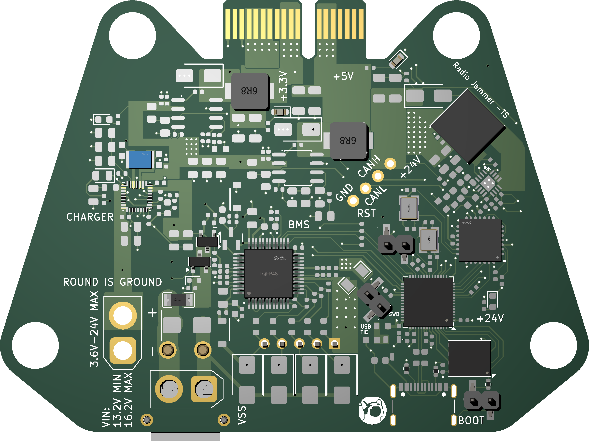
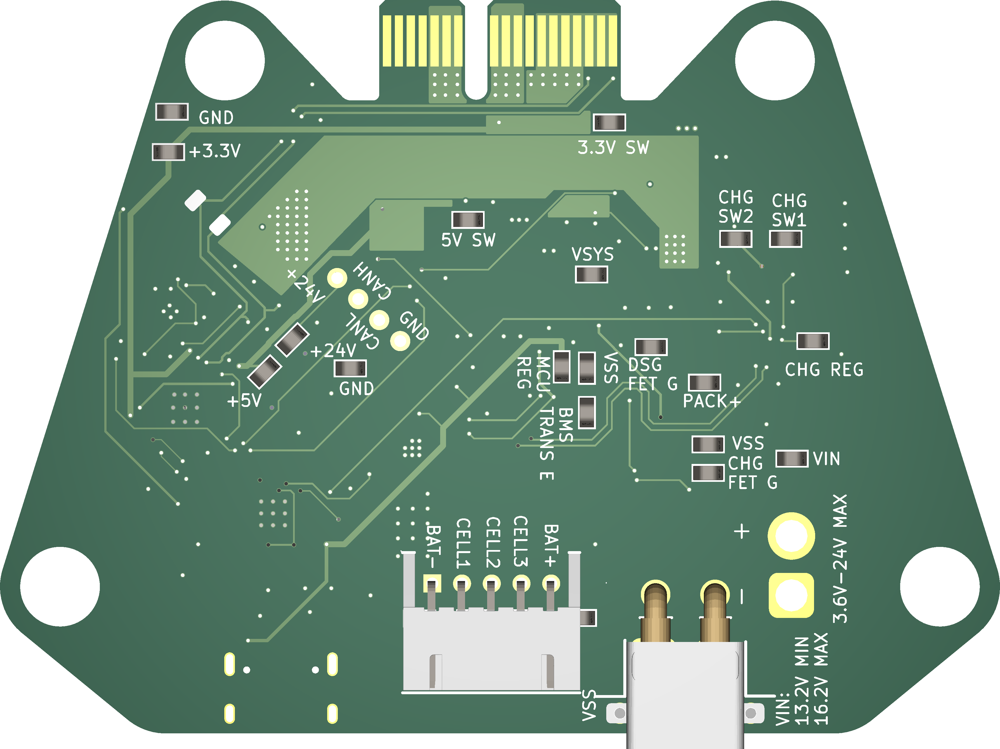
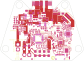
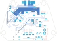

# 4 Inch Power Management Subsystem
I'm not gonna lie, this was a beast  

As part of the SPRINT ecosystem with MACH, this board was deisgned in the span of 5 days (From architecture to schematic to layout to production). These were not a good 5 days   

## Functionality
4 Cell BMS with high side protection FETs, integrated NVDC charging for up to 5A @ battery voltage, 3 power rails, 5V, 3.3V @ ~3A, 24V @1.8A (Shoutout Tristan)   
BMS supports up to ~5.7A due to the FET's, but if re speced, could probably go higher   
XT30's as output for 24V, input for charger and input for battery   
JST XH as input for cell balacing   
 Low side current sensing for OCP detection (or wtv else you need current for)  
 ## TODO:  
 I should change that load resistor but lowkey too tired rn :wilted_rose:   
 Order it lmao  
# Authors:  
 Architecture: javezki  
 BMS, 5V 3.3V: javezki  
 Charger, 24V Boost: kayessi 
 Layout: javezki
---

  

    
    
    
<em>3D Render</em>

  

   

  

     
    
<em>Schematic</em>

  

   
  
  

    
     
    <em>Footprint</em>
  

